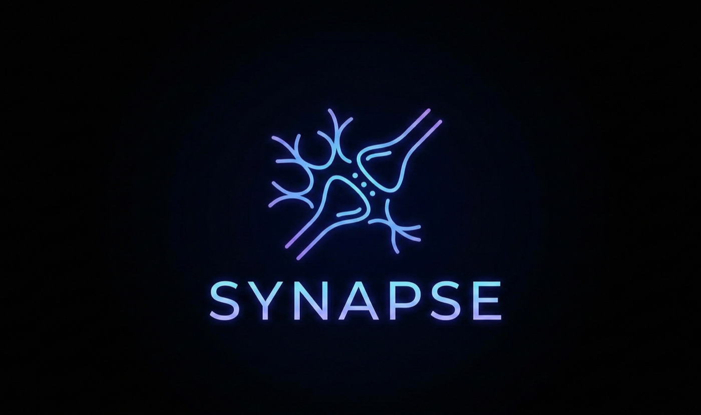

# Synapse Agent



[中文文档](README.zh-CN.md)

A self-growing AI agent framework built on a unified shell abstraction, with an interactive REPL, extensible tooling, and a reusable skill system.

## Open Source Docs

- [Contributing Guide](CONTRIBUTING.md)
- [Code of Conduct](CODE_OF_CONDUCT.md)
- [Changelog](CHANGELOG.md)

## Highlights

- **Unified Shell Abstraction**: three tool layers (Native Commands / Agent Shell / Extension Tools), so the LLM mainly learns one Bash-style interface
- **Multi-Provider LLM Support**: unified `LLMProvider` interface with built-in Anthropic, OpenAI, and Google adapters — switch providers at runtime without code changes
- **Event-Driven Architecture**: `EventStream` async iterable decouples Agent Core from UI, enabling flexible consumption patterns
- **Modular Monolith**: strict module boundaries enforced by `dependency-cruiser` fitness functions — `core`, `providers`, `tools`, `skills`, `sub-agents` each with clear dependency rules
- **Pluggable Operations**: `FileOperations` / `BashOperations` interfaces allow swapping execution environments (local, remote, sandbox)
- **Two-Layer Message System**: domain messages preserve full context; explicit `convertToLlm()` pure-function conversion for LLM API calls
- **Interactive REPL**: streaming output, tool execution status, and slash commands
- **MCP and Skill Extensions**: integrate external MCP tools and reusable local skills
- **Session Persistence and Resume**: manage and restore historical sessions
- **Auto Skill Enhancement**: distill reusable skills from completed tasks
- **Sub-Agents**: built-in `explore`, `general`, and `skill` sub-agents with independent EventStream and tool permission isolation

## Core Architecture

```text
┌──────────────────────────────────────────────────────────────┐
│                         cli (REPL)                           │
│                     consumes EventStream                     │
├──────────┬───────────┬───────────┬───────────┬──────────────┤
│sub-agents│  skills   │   tools   │  config   │              │
│          │           │ BashRouter│           │              │
│          │           │ 3-Layer   │           │              │
├──────────┴─────┬─────┴─────┬─────┴───────────┴──────────────┤
│     core       │ providers │                                │
│  EventStream   │ Anthropic │                                │
│  Agent Loop    │ OpenAI    │                                │
│  Messages      │ Google    │                                │
├────────────────┴───────────┴────────────────────────────────┤
│                        common                                │
│                  logger, errors, constants                    │
└──────────────────────────────────────────────────────────────┘
```

### Module Dependency Rules

| Module | Allowed Dependencies | Description |
|--------|---------------------|-------------|
| `core` | `common` | Event system, Agent Loop, message conversion |
| `providers` | `common` | LLMProvider adapters (Anthropic/OpenAI/Google) |
| `tools` | `core`(types), `common` | Three-layer tool system, pluggable operations |
| `skills` | `core`, `providers`, `common` | Skill generation and enhancement |
| `sub-agents` | `core`, `providers`, `tools`, `common` | Sub-agent lifecycle management |
| `cli` | all modules | Top-level consumer |
| `common` | (none) | Shared utilities |

## Install and Setup

### Local setup

```bash
bun install
cp .env.example .env
```

### Global install (use `synapse` anywhere)

```bash
# 1) Install dependencies
bun install

# 2) Create global link
bun link

# 3) Ensure ~/.bun/bin is in PATH (e.g. ~/.zshrc or ~/.bashrc)
export PATH="$HOME/.bun/bin:$PATH"

# 4) Reload shell config
source ~/.zshrc  # or source ~/.bashrc
```

If `bun link` fails with `package.json missing "name"`, run:

```bash
echo '{"name": "bun-global"}' > ~/.bun/install/global/package.json
```

### LLM settings

LLM settings are stored in `~/.synapse/settings.json`:

```json
{
  "env": {
    "ANTHROPIC_API_KEY": "your_api_key_here",
    "ANTHROPIC_BASE_URL": "https://api.anthropic.com"
  },
  "model": "claude-sonnet-4-5",
  "skillEnhance": {
    "autoEnhance": false,
    "maxEnhanceContextChars": 50000
  }
}
```

| Key | Description |
| --- | --- |
| `ANTHROPIC_API_KEY` | Required API key |
| `ANTHROPIC_BASE_URL` | Optional API endpoint |
| `model` | Model name (default: `claude-sonnet-4-5`) |
| `skillEnhance.autoEnhance` | Enable/disable auto skill enhancement |
| `skillEnhance.maxEnhanceContextChars` | Context size limit for enhancement analysis |

> Note: Synapse Agent supports multiple LLM providers through a unified `LLMProvider` interface.
> Built-in adapters: **Anthropic**, **OpenAI**, **Google**.
> You can also use Anthropic-compatible endpoints (e.g. MiniMax) via `ANTHROPIC_BASE_URL`.

#### MiniMax (Anthropic-compatible)

MiniMax can be used with Synapse Agent through an Anthropic-compatible API surface.
In this setup:

- `ANTHROPIC_API_KEY`: use your MiniMax API key
- `ANTHROPIC_BASE_URL`: use the MiniMax-compatible endpoint
- `model`: use a MiniMax model name (the author commonly uses `minimax-2.1`)

Example:

```json
{
  "env": {
    "ANTHROPIC_API_KEY": "<your-minimax-api-key>",
    "ANTHROPIC_BASE_URL": "https://api.minimaxi.chat/v1"
  },
  "model": "minimax-2.1"
}
```

References:

- [MiniMax API Overview](https://platform.minimaxi.com/docs/api-reference/api-overview)
- [Anthropic API Overview](https://platform.claude.com/docs/en/api/overview)

See `.env.example` for additional optional settings (logging, persistence, enhancement strategy, etc.).

## Quick Start

```bash
# After global install
synapse chat

# Or from project directory
bun run chat
```

## REPL Commands

### Slash commands (`/`)

| Command | Description |
| --- | --- |
| `/help` | Show help |
| `/exit` | Exit REPL |
| `/clear` | Clear conversation history |
| `/cost` | Show token/cost usage for current session |
| `/context` | Show context usage stats |
| `/compact` | Compact conversation history |
| `/model` | Show current model |
| `/tools` | List available tools |
| `/resume` | Show resumable sessions and choose one |
| `/resume --latest` | Resume latest session |
| `/resume <id>` | Resume by session ID |

### Skill commands

| Command | Description |
| --- | --- |
| `/skill:list` | List installed skills |
| `/skill:info <name>` | Show skill details and versions |
| `/skill:import <src>` | Import skills from local directory or URL |
| `/skill:rollback <name> [version]` | Roll back a skill version |
| `/skill:delete <name>` | Delete a skill and its version history |
| `/skill enhance` | Show auto skill enhancement status |
| `/skill enhance --on` | Enable auto skill enhancement |
| `/skill enhance --off` | Disable auto skill enhancement |
| `/skill enhance -h` | Show skill enhancement help |

### Shell commands (`!`)

```bash
!ls -la
!git status
```

## Tooling Model

### Layer 2: Agent Shell

| Command | Description |
| --- | --- |
| `read <file>` | Read file (supports offset and line limits) |
| `write <file>` | Create/overwrite file |
| `edit <file>` | Regex-based text replacement |
| `bash <cmd>` | Execute native shell command |

For file discovery and content search, prefer native commands such as `find`, `rg`, and `grep`.

### Layer 3: Extension Tools

| Command | Description |
| --- | --- |
| `tools search` | Search tools (supports `--type=mcp\|skill`) |
| `skill search` | Semantic skill search |
| `mcp:*` | Invoke MCP tools |
| `skill:*` | Invoke skill scripts |
| `task:*` | Run sub-agent tasks |

## Advanced Features

### Session persistence and resume

- Session files are stored in `~/.synapse/sessions/` by default
- Session directory can be overridden with `SYNAPSE_SESSIONS_DIR`
- Use `/resume` or `/resume --latest`

### Auto skill enhancement

- `/skill enhance --on` to enable
- `/skill enhance --off` to disable
- Setting is persisted in `~/.synapse/settings.json` (`skillEnhance.autoEnhance`)

### Sub-agents

- `explore`: repository exploration
- `general`: general task handling
- `skill`: skill generation

## MCP Configuration

Default lookup paths:

- `./mcp_servers.json`
- `~/.synapse/mcp/mcp_servers.json`

Example:

```json
{
  "mcpServers": {
    "server-name": {
      "command": "node",
      "args": ["server.js"]
    }
  }
}
```

## Project Structure

```text
├── src/
│   ├── core/               # Agent Core: EventStream, Agent Loop, messages
│   ├── providers/           # LLM Provider adapters (Anthropic/OpenAI/Google)
│   │   ├── anthropic/
│   │   ├── openai/
│   │   └── google/
│   ├── tools/               # Three-layer tool system
│   │   ├── operations/      # Pluggable operations (FileOps/BashOps)
│   │   ├── handlers/        # Agent Shell command handlers
│   │   └── converters/      # MCP/Skill converters
│   ├── skills/              # Skill generation and enhancement
│   ├── sub-agents/          # Sub-agent lifecycle management
│   ├── common/              # Logger, errors, constants
│   ├── cli/                 # REPL and terminal UI
│   ├── config/              # Configuration management
│   ├── agent/               # Legacy agent runner
│   ├── utils/               # Utility functions
│   └── resource/            # System prompts
├── tests/
│   ├── unit/                # Unit tests (mirrors src/ structure)
│   ├── integration/         # Integration tests
│   └── e2e/                 # End-to-end CLI tests
├── docs/
│   ├── architecture/        # Architecture design and ADRs
│   └── requirements/        # PRD and BDD acceptance criteria
├── assets/
│   └── logo.png
├── README.md
├── README.zh-CN.md
├── CLAUDE.md
├── CONTRIBUTING.md
├── CODE_OF_CONDUCT.md
├── LICENSE
└── CHANGELOG.md
```

## Development Commands

```bash
bun run lint          # ESLint (Flat Config, strict mode)
bun run typecheck     # TypeScript strict type checking
bun test              # Run all tests
bun test tests/unit/  # Unit tests only
bun test tests/integration/  # Integration tests only
bun run test:arch     # Architecture fitness tests (dependency-cruiser)
bun run test:cov      # Tests with coverage report
bun run test:e2e      # End-to-end tests
bun run validate      # Run all checks (lint + typecheck + tests + arch)
```

## Tech Stack

- Runtime: Bun 1.3.9
- Language: TypeScript (strict mode)
- LLM SDKs: `@anthropic-ai/sdk`, `openai`, `@google/genai`
- MCP: `@modelcontextprotocol/sdk`
- Validation: Zod
- Logging: pino + pino-pretty
- Terminal UI: Ink + `@inkjs/ui`
- CLI: Commander.js
- Architecture Testing: dependency-cruiser

## Acknowledgements

Inspired by:

- [philschmid/mcp-cli](https://github.com/philschmid/mcp-cli)
- [shareAI-lab/learn-claude-code](https://github.com/shareAI-lab/learn-claude-code)

## Contact

- Email: [wuwenjun19930614@gmail.com](mailto:wuwenjun19930614@gmail.com)

## License

MIT
